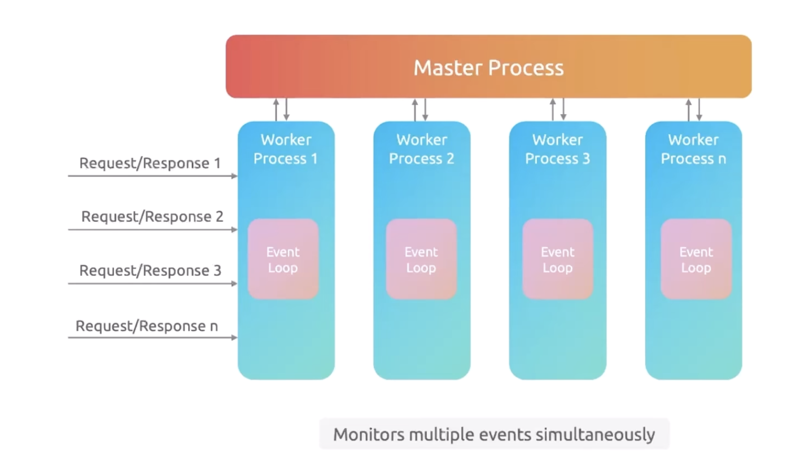

# Nginx

Nginx is a web server that handles HTTP requests, and can also act as load balancer, cache, rate limiter, reverse proxy. Nginx is smart at handling requests at scale and performant. It's alternatives are Apache, Litespeed, IIS etc.

## Working of Nginx

Nginx follows an event-driven architecture. When requests arrive, it responds to them. It has event loop that receives the incoming requests, send them to workers. Workers are processes which does actual processing of requests. Nginx has multi-process architecture where each worker handles multiple connections asynchronously. There is a master worker or master process that oversees and controls all the child workers. By controlling, it handles CPU, memory usage, task assignment, reassignment in case of dead worker.

Incoming HTTP request -> Event Loop -> Processing of event by Worker -> Response sent



## Nginx Use cases

Nginx dominates one third of the web-server market. It has many use-cases - 

1. Load Balancer - Nginx acts as a balancer to route incoming traffic to multiple nodes facilitating load balancing.
2. Reverse Proxy - Nginx sits in front of backend servers and forwards client requests to them, then returns the server's response to the client. For example, when a user visits a website, Nginx receives the request and proxies it to one or more backend application servers (like Node.js, Python, or Java apps). The backend server processes the request and sends the response back through Nginx to the user. This provides benefits like load distribution, security (hiding backend server IPs), and centralized request handling. Nginx can proxy requests to different backends based on URL paths or other criteria.
3. Cache - Can act as cache to enhance performance.
4. Rate limiting - it has rate limiting configuration which allows to limit the incoming requests right at nginx before it hits the app.
5. Forward Proxy - it can sit between a network of users and internet as forward proxy. It can help with traffic filtering, restrictions.


## Nginx Configuration File

There is a `nginx.conf` file where global configuration settings are stored. This file typically contains - 
1. HTTP Block - handles everything related to web traffic. Contains server block and settings for HTTP optimizations and security
2. Server Block - defines how nginx handles requests for domain and sub-domain
3. Event Block - controls networking connections

```
user www-data;
pid /var/run/nginx.pid;

error_log /var/log/nginx.error_log info;

events {
    worker_connections 2000;
}

http {
    gzip on;
    gzip_types text/plain;

    sendfile         on;
    tcp_nopush       on;
    tcp_nodelay      on;
    send_lowat       12000;

    server {
        listen example.com;
        server_name example.com www.example.com;

        access_log /var/www/nginx.access_log main;

        location / {
            try_files $uri $uri/ =404;
        }
    }
}

```

## Directory Structure

1. `/etc/nginx/nginx.conf` - the main configuration file
2. `/etc/nginx/sites-available` - contains configuration files for each website
3. `/etc/nginx/sites-enabled` - contains symlinks of websites that are enabled to be served in sites-available
4. `/etc/nginx/conf.d` - stores additional config files
5. `/var/www` - default directory for website content
6. `/etc/nginx/mime.types` - defines mime types for file extension
7. `/etc/nginx/nginx.pid` - stores the process ID
8. `/var/log/nginx` - stores log file

## Nginx Commands

1. `nginx -h` - help menu
2. `nginx -v` - version
3. `nginx -V` - provides detailed build and config info, including modules
4. `nginx -t` - validates configuration file for syntax issues
5. `nginx -T` - useful for sharing config when seeking support
6. `nginx -s` - sends signal to nginx master process
   1. Stop
   2. Quit
   3. Reopen
   4. Reload
7. `systemctl status nginx` - status of nginx process
8. `systemctl start nginx` - start nginx
9. `systemctl restart nginx` - restart nginx
10. `systemctl reload nginx` - reloads nginx